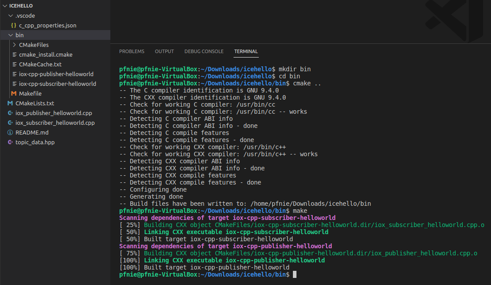

# icehello

## Introduction

This example demonstrates a basic data transmission with zero-copy inter-process communication (IPC). It provides a publisher and a subscriber application.


## Publisher

At first, we need to define what kind of data type the publisher and subscriber application will exchange:

## Subscriber

The subscriber needs to have similar includes, but unlike the publisher `subscriber.hpp` is included:


## Compile

```
mkdir bin
cd bin
cmake ..
make
```




## Expected Output

### 1.

<video width="700" controls>
	<source src="/en/latest/_static/icehello01.mp4" />
</video>

### 2.


## Reference：

1. [https://github.com/eclipse-iceoryx/iceoryx/tree/v2.0.0/iceoryx_examples/icehello](https://github.com/eclipse-iceoryx/iceoryx/tree/v2.0.0/iceoryx_examples/icehello)
2. [https://iceoryx.io/v2.0.0/examples/icehello/](https://iceoryx.io/v2.0.0/examples/icehello/)
