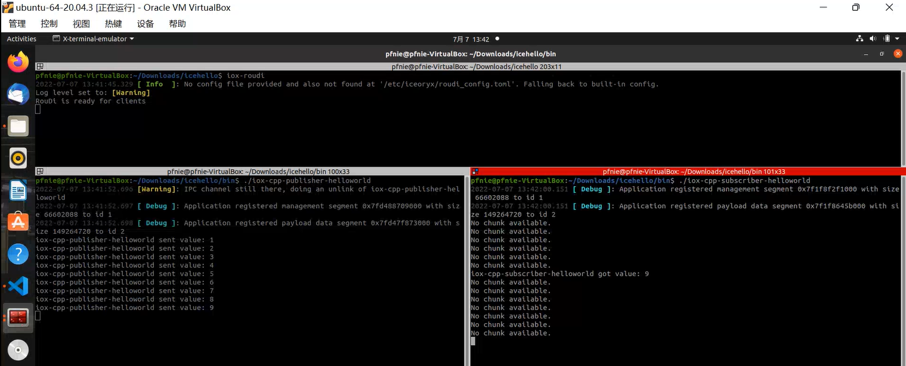
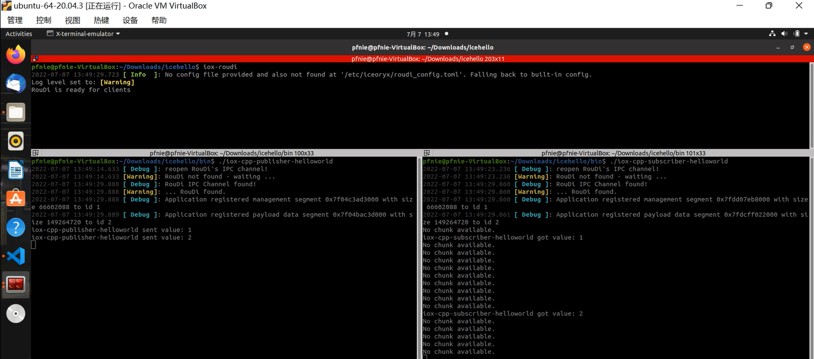

# icehello

## 1. Introduction

This example demonstrates a basic data transmission with zero-copy inter-process communication (IPC). It provides a publisher and a subscriber application.

## 2. Publisher

At first, we need to define what kind of data type the publisher and subscriber application will exchange:

## 3. Subscriber

The subscriber needs to have similar includes, but unlike the publisher `subscriber.hpp` is included:

## 4. Compile

```
mkdir bin
cd bin
cmake ..
make
```


## 5. Expected Output

### 5.1. Start RouDi Firstly

#### 5.1.1. Image



#### 5.1.2. Video

<video width="700" controls>
	<source src="/en/latest/_static/icehello01.mp4" />
</video>


### 5.2. Start RouDi Lastly

#### 5.2.1. Image



#### 5.2.2. Video

<video width="700" controls>
	<source src="/en/latest/_static/icehello02.mp4" />
</video>

## 6. Reference：

1. [https://github.com/eclipse-iceoryx/iceoryx/tree/v2.0.0/iceoryx_examples/icehello](https://github.com/eclipse-iceoryx/iceoryx/tree/v2.0.0/iceoryx_examples/icehello)
2. [https://iceoryx.io/v2.0.0/examples/icehello/](https://iceoryx.io/v2.0.0/examples/icehello/)
