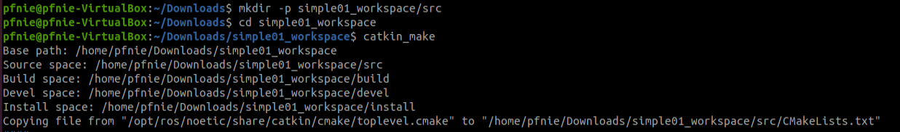
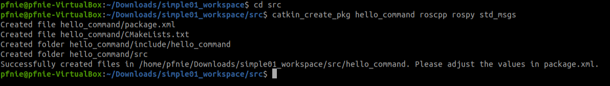
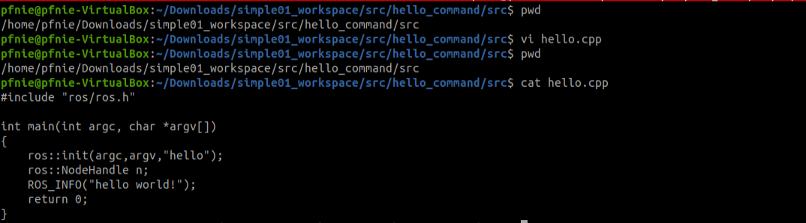
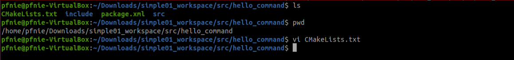
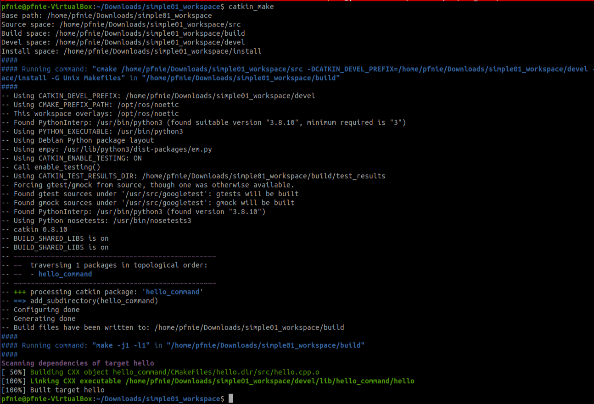
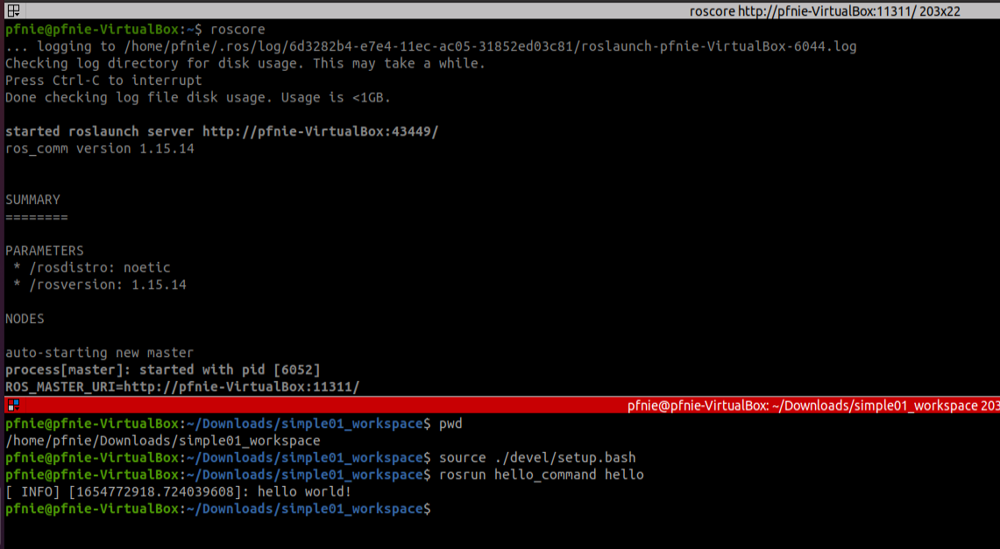

# hello world for command

**Step1: create workspace and initialization**

```
mkdir -p simple01_workspace/src
cd simple01_workspace
catkin_make
```



**Step2: create dependency package**

```
cd src
catkin_create_pkg hello_command roscpp rospy std_msgs
```



The above command will generate a function package in the workspace, which depends on roscpp, rospy and std_msgs, where roscpp is a library implemented in C++, rospy is a library implemented in python, and std_msgs is a standard message library. Create When ROS function packages are used, they generally rely on these three libraries for implementation.

**Step3: add hello.cp in /src/hello_command/src folder**

```c++
#include "ros/ros.h"

int main(int argc, char *argv[])
{
    ros::init(argc,argv,"hello");
    ros::NodeHandle n;
    ROS_INFO("hello world!");
    return 0;
}
```



**Step4: update CMakelist.txt**

Before we build the package, you can add the following few lines to the bottom of your CMakeLists.txt. Or you can search the cmake functions to make changes. The second ways is preferred as you gain more experience with ROS. But the first method is fine.

```
add_executable(hello src/hello.cpp)
target_link_libraries(hello ${catkin_LIBRARIES})
```



**Step5: make**

```
cd simple01_workspace
catkin_make
```



**Step6:  start roscore** **& start hello_command**

```
roscore

cd simple01_workspace
source ./devel/setup.bash
rosrun hello_command hello
```



**Reference：**

1. [http://wiki.ros.org/action/fullsearch/catkin/commands/catkin_make](http://wiki.ros.org/action/fullsearch/catkin/commands/catkin_make)
2. [https://docs.ros.org/en/rolling/Tutorials/Creating-Your-First-ROS2-Package.html](https://docs.ros.org/en/rolling/Tutorials/Creating-Your-First-ROS2-Package.html)
